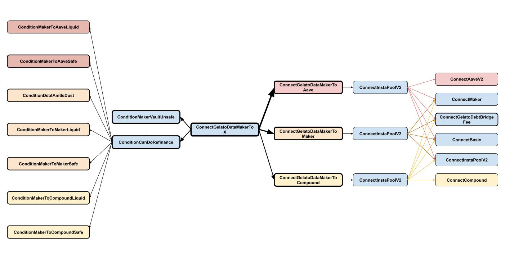

## Auto-Debt-Bridge: MakerToX specs

**Goal:** If a dsa's Maker vault becomes unsafe, move its debt over to Aave or ETH-B or Compound, to **1) safe the position 2) without having to sell collateral**

The goal thus can be summarized as: _**reduce risk of liquidation without tapping into the collateral for self-liquidation**_

**Out of scope:** It is **not** the goal of this automated feature, to **prevent vault liquidation** under all circumanstances.

### Contract Architecture

### Conditions

#### ConditionMakerVaultUnsafeOSM

- [ConditionMakerVaultUnsafeOSM](../contracts/contracts/gelato/conditions/maker/ConditionMakerVaultUnsafeOSM.sol)

- [FMakerVaultUnsafeOSM](../contracts/functions/gelato/conditions/maker/FMakerVaultUnsafeOSM.sol)

- [deployment](../deployments/mainnet/ConditionMakerVaultUnsafeOSM.json)

#### ConditionCanDoRefinance

- [ConditionCanDoRefinance](../contracts/contracts/gelato/conditions/ConditionCanDoRefinance.sol)

- [FGelatoDebtBridge \_getDebtBridgeRoute](../contracts/functions/gelato/FGelatoDebtBridge.sol)

- [FCanDoRefinance](../contracts/functions/gelato/conditions/FCanDoRefinance.sol)

- deployment (not yet deployed)

#### ConditionMakerToAaveLiquid

- [ConditionMakerToAaveLiquid](../contracts/contracts/gelato/conditions/aave/ConditionMakerToAaveLiquid.sol)

- [FAaveHasLiquidity](../contracts/functions/gelato/conditions/aave/FAaveHasLiquidity.sol)

- [FGelatoDebtBridge \_getMaxAmtToBorrowMakerToAave](../contracts/functions/gelato/FGelatoDebtBridge.sol)

- deployment (not yet deployed)

#### ConditionMakerToAaveSafe

- [ConditionMakerToAaveSafe](../contracts/contracts/gelato/conditions/aave/ConditionMakerToAaveSafe.sol)

- [FAavePositionWillBeSafe](../contracts/functions/gelato/conditions/aave/FAavePositionWillBeSafe.sol)

- [FGelatoDebtBridge \_getMaxAmtToBorrowMakerToAave](../contracts/functions/gelato/FGelatoDebtBridge.sol)

- deployment (not yet deployed)

#### ConditionMakerToMakerLiquid

- [ConditionMakerToMakerLiquid](../contracts/contracts/gelato/conditions/maker/ConditionMakerToMakerLiquid.sol)

- [FDebtCeilingIsReached](../contracts/functions/gelato/conditions/maker/FDebtCeilingIsReached.sol)

- [FMaker \_debtCeilingIsReached](../contracts/functions/dapps/FMaker.sol)

- [FGelatoDebtBridge \_getMaxAmtToBorrowMakerToMaker](../contracts/functions/gelato/FGelatoDebtBridge.sol)

- deployment (not yet deployed)

#### ConditionMakerToMakerSafe

- [ConditionMakerToMakerSafe](../contracts/contracts/gelato/conditions/maker/ConditionMakerToMakerSafe.sol)

- [FDestVaultWillBeSafe](../contracts/functions/gelato/conditions/maker/FDestVaultWillBeSafe.sol)

- [FMaker \_vaultWillBeSafe](../contracts/functions/dapps/FMaker.sol)

- [FGelatoDebtBridge \_getMaxAmtToBorrowMakerToMaker](../contracts/functions/gelato/FGelatoDebtBridge.sol)

- deployment (not yet deployed)

#### ConditionDebtAmtIsDust

- [ConditionDebtAmtIsDust](../contracts/contracts/gelato/conditions/maker/ConditionDebtAmtIsDust.sol)

- [FIsDebtAmtDust](../contracts/functions/gelato/conditions/maker/FIsDebtAmtDust.sol)

- [FMaker \_debtIsDust](../contracts/functions/dapps/FMaker.sol)

- deployment (not yet deployed)

#### ConditionMakerToCompoundLiquid

- [ConditionMakerToCompoundLiquid](../contracts/contracts/gelato/conditions/compound/ConditionMakerToCompoundLiquidity.sol)

- [FCompoundHasLiquidity](../contracts/functions/gelato/conditions/compound/FCompoundHasLiquidity.sol)

- [FGelatoDebtBridge \_getMaxAmtToBorrowMakerToCompound](../contracts/functions/gelato/FGelatoDebtBridge.sol)

- deployment (not yet deployed)

#### ConditionMakerToCompoundSafe

- [ConditionMakerToCompoundSafe](../contracts/contracts/gelato/conditions/compound/ConditionMakerToCompoundSafe.sol)

- [FCompoundPositionWillBeSafe](../contracts/functions/gelato/conditions/compound/FCompoundPositionWillBeSafe.sol)

- [FCompound \_wouldCompoundAccountBeLiquid](../contracts/functions/dapps/FCompound.sol)

- [FGelatoDebtBridge \_getMaxAmtToBorrowMakerToCompound](../contracts/functions/gelato/FGelatoDebtBridge.sol)

- deployment (not yet deployed)

### Connectors

#### ConnectGelatoDataMakerToX

- [ConnectGelatoDataMakerToX](../contracts/contracts/connectors/debt_bridge/from_maker/ConnectGelatoDataMakerToX.sol)

- [FGelatoDebtBridge \_getDebtBridgeRoute](../contracts/functions/gelato/FGelatoDebtBridge.sol)

- [FCanDoRefinance](../contracts/functions/gelato/conditions/FCanDoRefinance.sol)

- deployment (not yet deployed)

#### ConnectGelatoDataMakerToAave

- [ConnectGelatoDataMakerToAave](../contracts/contracts/connectors/debt_bridge/from_maker/ConnectGelatoDataMakerToAave.sol)

- [BInstaFeeCollector](../contracts/contracts/connectors/base/BInstaFeeCollector.sol)

- [FGelato \_getGelatoExecutorFees](../contracts/functions/gelato/FGelato.sol)

- [FGelatoDebtBridge \_getGasCostMakerToAave](../contracts/functions/gelato/FGelatoDebtBridge.sol)

- deployment (not yet deployed)

#### ConnectGelatoDataMakerToMaker

- [ConnectGelatoDataMakerToMaker](../contracts/contracts/connectors/debt_bridge/from_maker/ConnectGelatoDataMakerToMaker.sol)

- [BInstaFeeCollector](../contracts/contracts/connectors/base/BInstaFeeCollector.sol)

- [FGelato \_getGelatoExecutorFees](../contracts/functions/gelato/FGelato.sol)

- [FGelatoDebtBridge \_getGasCostMakerToMaker](../contracts/functions/gelato/FGelatoDebtBridge.sol)

- deployment (not yet deployed)

#### ConnectGelatoDataMakerToCompound

- [ConnectGelatoDataMakerToCompound](../contracts/contracts/connectors/debt_bridge/from_maker/ConnectGelatoDataMakerToCompound.sol)

- [BInstaFeeCollector](../contracts/contracts/connectors/base/BInstaFeeCollector.sol)

- [FGelato \_getGelatoExecutorFees](../contracts/functions/gelato/FGelato.sol)

- [FGelatoDebtBridge \_getGasCostMakerToCompound](../contracts/functions/gelato/FGelatoDebtBridge.sol)

- deployment (not yet deployed)

#### ConnectGelatoDebtBridgeFee

- [ConnectGelatoDebtBridgeFee](../contracts/contracts/connectors/debt_bridge/ConnectGelatoDebtBridgeFee.sol)

- deployment (not yet deployed)
